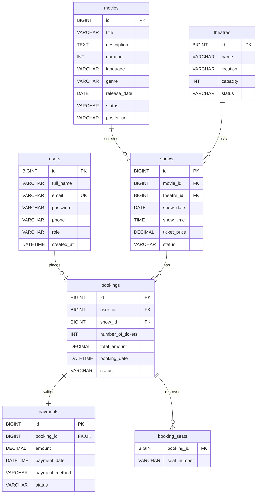

# Movie Ticket Booking System - Backend

A production-grade, layered RESTful API for an online Movie Ticket Booking System built with **Spring Boot 3**, **Spring Security (JWT)**, **Spring Data JPA**, and **MySQL**. Developed according to the IJSE CMJD 114/115 Coursework Specification.

---

## 1. Technologies Used

- **Java 17 / 21 / 25**
- **Spring Boot 3.x**
  - Spring Web (RESTful APIs)
  - Spring Data JPA (Hibernate ORM)
  - Spring Security (Stateless JWT Authentication & RBAC)
  - Spring Validation (`jakarta.validation`)
- **Database:** MySQL 8.x
- **JWT (JSON Web Token):** `jjwt-api` / `jjwt-impl` (0.11.5)
- **Utilities:** Lombok, SLF4J / Logback
- **Build Tool:** Apache Maven (Wrapper included)

---

## 2. System Architecture

The project strictly adheres to the standard **Layered Architecture**:
```
Controller Layer  -->  Service Layer  -->  Repository Layer  -->  MySQL Database
        |                     |
        v                     v
   DTOs & Mappers      Custom Exceptions
```
- **Controllers:** Expose RESTful endpoints, validate input payloads, and handle HTTP status codes.
- **Services:** Enforce business logic, transactions (`@Transactional`), security checks, and `@Slf4j` logging.
- **Repositories:** Spring Data JPA interfaces with custom JPQL queries and conflict checks.
- **GlobalExceptionHandler:** Centralized `@RestControllerAdvice` returning structured `ErrorResponse` objects with standard HTTP statuses (400, 401, 403, 404, 409, 500).

---

## 3. Database Configuration & Environment Variables

The application can be configured via `src/main/resources/application.properties` or overridden using environment variables:

| Variable | Default Value | Description |
|---|---|---|
| `DB_URL` | `jdbc:mysql://localhost:3306/movie_booking_db?createDatabaseIfNotExist=true&useSSL=false&allowPublicKeyRetrieval=true` | JDBC Connection URL |
| `DB_USERNAME` | `root` | Database username |
| `DB_PASSWORD` | *(empty string)* | Database password |
| `JWT_SECRET` | `9a4f2c8d3e7b1a5f6c8d2e4a7b9c1d3f5a7b9c1d3e5f7a9b1c3d5e7f9a1b3d5e` | HMAC-SHA 256-bit Secret Key |
| `SERVER_PORT` | `8080` | Embedded Tomcat server port |

---

## 4. Entity Relationship Diagram (ERD)



---

## 5. API Endpoints Table

### Authentication (`/api/auth`)
| Method | Endpoint | Required Role | Description |
|---|---|---|---|
| `POST` | `/api/auth/signup` | Public | Register a new user (`ROLE_CUSTOMER` or `ROLE_ADMIN`) |
| `POST` | `/api/auth/signin` | Public | Authenticate and obtain JWT token |

### Movies (`/api/movies`)
| Method | Endpoint | Required Role | Description |
|---|---|---|---|
| `GET` | `/api/movies` | Public | Search/filter movies by `title`, `genre`, `language`, `status` |
| `GET` | `/api/movies/{id}` | Public | Get single movie details by ID |
| `POST` | `/api/movies` | `ADMIN` | Create a new movie |
| `PUT` | `/api/movies/{id}` | `ADMIN` | Update an existing movie |
| `DELETE` | `/api/movies/{id}` | `ADMIN` | Delete a movie |

### Theatres (`/api/theatres`)
| Method | Endpoint | Required Role | Description |
|---|---|---|---|
| `GET` | `/api/theatres` | Public | List theatres (filter by optional `status`) |
| `GET` | `/api/theatres/{id}` | Public | Get theatre details by ID |
| `POST` | `/api/theatres` | `ADMIN` | Create a new theatre |
| `PUT` | `/api/theatres/{id}` | `ADMIN` | Update theatre details |
| `DELETE` | `/api/theatres/{id}` | `ADMIN` | Delete theatre |

### Shows (`/api/shows`)
| Method | Endpoint | Required Role | Description |
|---|---|---|---|
| `GET` | `/api/shows` | Public | List shows (filter by optional `movieId`, `theatreId`, `date`) |
| `GET` | `/api/shows/{id}` | Public | Get show details by ID |
| `GET` | `/api/shows/{id}/seats` | Public | Get booked and available seat lists |
| `POST` | `/api/shows` | `ADMIN` | Schedule a new show (with conflict validation) |
| `PUT` | `/api/shows/{id}` | `ADMIN` | Update scheduled show |
| `DELETE` | `/api/shows/{id}` | `ADMIN` | Delete a show |

### Bookings (`/api/bookings`)
| Method | Endpoint | Required Role | Description |
|---|---|---|---|
| `POST` | `/api/bookings` | `CUSTOMER` / `ADMIN` | Create a booking with seat conflict checks |
| `GET` | `/api/bookings/my-bookings` | `CUSTOMER` / `ADMIN` | Get authenticated user's bookings |
| `GET` | `/api/bookings/{id}` | Owner or `ADMIN` | Get booking details by ID |
| `PUT` | `/api/bookings/{id}/cancel` | Owner or `ADMIN` | Cancel a booking (releases booked seats) |
| `GET` | `/api/bookings` | `ADMIN` | List all bookings |
| `PUT` | `/api/bookings/{id}/status` | `ADMIN` | Manually update booking status |

### Payments (`/api/payments`)
| Method | Endpoint | Required Role | Description |
|---|---|---|---|
| `POST` | `/api/payments` | Owner or `ADMIN` | Create payment record for a booking |
| `POST` | `/api/payments/{id}/process` | Owner or `ADMIN` | Process payment (`?success=true/false`) |
| `GET` | `/api/payments/{id}` | Owner or `ADMIN` | Get payment details by ID |
| `GET` | `/api/payments/{id}/status` | Owner or `ADMIN` | Check payment status |
| `GET` | `/api/payments/booking/{bookingId}` | Owner or `ADMIN` | Get payment by booking ID |
| `GET` | `/api/payments` | `ADMIN` | List all payment transactions |

### Users (`/api/users`)
| Method | Endpoint | Required Role | Description |
|---|---|---|---|
| `GET` | `/api/users` | `ADMIN` | List all registered users |
| `GET` | `/api/users/{id}` | `ADMIN` | Get user details by ID |
| `PUT` | `/api/users/{id}` | `ADMIN` | Update user profile / role |
| `DELETE` | `/api/users/{id}` | `ADMIN` | Delete user (prevents self-deletion) |

---

## 6. Authentication Guide

All protected endpoints require a JWT token in the HTTP `Authorization` header:
```http
Authorization: Bearer <your_jwt_token_here>
```

### Sign Up Sample
```bash
curl -X POST http://localhost:8080/api/auth/signup \
  -H "Content-Type: application/json" \
  -d '{
    "fullName": "Jane Doe",
    "email": "jane@example.com",
    "password": "Password@123",
    "phone": "0771234567",
    "role": "ROLE_CUSTOMER"
  }'
```

### Sign In Sample
```bash
curl -X POST http://localhost:8080/api/auth/signin \
  -H "Content-Type: application/json" \
  -d '{
    "email": "customer@moviebooking.com",
    "password": "Customer@123"
  }'
```
Response:
```json
{
  "token": "eyJhbGciOiJIUzI1NiIsInR5cCI6IkpXVCJ9...",
  "type": "Bearer",
  "id": 2,
  "email": "customer@moviebooking.com",
  "fullName": "Demo Customer",
  "role": "ROLE_CUSTOMER"
}
```

---

## 7. Pre-seeded Demo Accounts

When the application starts with an empty database, the `DataSeeder` automatically generates:

| Account Type | Email | Password | Role |
|---|---|---|---|
| **Administrator** | `admin@moviebooking.com` | `Admin@123` | `ROLE_ADMIN` |
| **Customer** | `customer@moviebooking.com` | `Customer@123` | `ROLE_CUSTOMER` |

Initial database seed also includes 5 movies with varying genres/statuses, 2 active theatres, and multiple upcoming shows.

---

## 8. How to Run the Backend

### Prerequisites
- JDK 17, 21, or 25 installed
- MySQL Server 8 running on port 3306 with database `movie_booking_db` (or allow auto-creation)

### Run via Maven Wrapper
```bash
# On Linux / macOS
./mvnw clean spring-boot:run

# On Windows PowerShell / Command Prompt
.\mvnw.cmd clean spring-boot:run
```

### Package and Run JAR
```bash
# On Windows
.\mvnw.cmd clean package -DskipTests
java -jar target/movie-booking-backend-0.0.1-SNAPSHOT.jar
```
The server will start at `http://localhost:8080`.


---

## 9. Future Expansion Proposals

### Proposal 1: Multiple Screens / Auditoriums per Theatre
- **Feature Overview:** Support multiplex cinemas where a single theatre facility manages multiple auditoriums (e.g., "Screen 1 (Standard)", "Screen 2 (IMAX)", "Screen 3 (VIP)"), each with distinct seating capacities, audio/visual formats, and tier pricing.
- **Why It Is Useful:** In real-world cinema operations, theatres host multiple concurrent screenings. Without screen management, a theatre can only host one show at a specific timeslot across the entire venue.
- **Affected Existing Entities:**
  - `Theatre`: Represents the physical venue/branch rather than an individual cinema hall.
  - `Show`: Associates with an individual `Screen` instead of directly with `Theatre`.
  - `Booking`: Seating capacity and seat assignments validate against the specific screen.
- **New Entities Needed:**
  - `Screen`: Fields include `id`, `theatre_id`, `name` (e.g., "Screen 1"), `screen_type` (IMAX, 3D, Standard, 4DX), `total_seats`.
  - `Seat`: Optional entity modeling individual physical seats with row, number, and category (Regular, Premium, Recliner).
- **Database Relationship Extension:**
  - `theatres (1) <---> (N) screens`
  - `screens (1) <---> (N) shows`
  - `screens (1) <---> (N) seats`

### Proposal 2: Promotional & Discount Codes
- **Feature Overview:** Enable promotional coupons and discount vouchers (e.g., `WELCOME10`, `SAVE20`) that customers can apply at checkout to receive percentage or flat-amount discounts.
- **Why It Is Useful:** Essential for marketing campaigns, seasonal promotions, student/senior discounts, and partner offers, driving customer acquisition and sales volume.
- **Affected Existing Entities:**
  - `Booking`: Stores `original_amount`, `discount_amount`, `final_amount`, and optional reference to applied promo code.
  - `Payment`: Charges the discounted `final_amount`.
- **New Entities Needed:**
  - `Promotion`: Fields include `id`, `code` (Unique), `discount_type` (`PERCENTAGE`, `FLAT`), `discount_value`, `min_spend`, `max_discount`, `valid_from`, `valid_to`, `usage_limit`, `times_used`, `is_active`.
  - `UserPromotionUsage`: Tracks user-specific usage counts to enforce single-use restrictions per customer.
- **Database Relationship Extension:**
  - `promotions (1) <---> (N) bookings` (nullable foreign key `promotion_id` on `bookings`)
  - `users (1) <---> (N) user_promotion_usages <---> (1) promotions`

---

## 10. Repository Submission

- **GitHub Organization:** [`movie-booking-nadish`](https://github.com/movie-booking-nadish)
- **Backend Repository:** [`https://github.com/movie-booking-nadish/movie-booking-backend`](https://github.com/movie-booking-nadish/movie-booking-backend)
- **Frontend Repository:** [`https://github.com/movie-booking-nadish/movie-booking-frontend`](https://github.com/movie-booking-nadish/movie-booking-frontend)

### Quick Start
```bash
# Clone the repository
git clone https://github.com/movie-booking-nadish/movie-booking-backend.git
cd movie-booking-backend

# Ensure MySQL is running on port 3306 (or configure DB_URL, DB_USERNAME, DB_PASSWORD)
# Run the application
./mvnw spring-boot:run
```